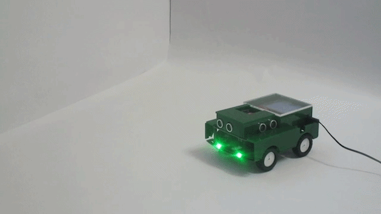

# 🚀 AromaID – Autonomous IoT Robot for Real-Time Odor Detection
Real-time IoT robotic system combining Embedded control, Machine Learning and backend processing.

## 🚀 Autonomous Robot in Action

▶️ [Watch full demo video](https://drive.google.com/file/d/1MG78STgNTEv-HPWVZA0KQI0r78wlkXUO/view?usp=sharing)


---

## 📌 Overview
AromaID is an end-to-end IoT robotic system that detects odors in real time using gas sensors and machine learning.

The system combines:
- ESP32-based robot (C++)
- Python backend
- Machine learning model
- SQL Server database
- React dashboard

---


## 💡 Highlights

- End-to-end system combining hardware and software
- Real-time decision making based on sensor data
- Integration of Embedded systems with Machine Learning
  
---


## 🧠 System Architecture
```
ESP32 (C++)
↓ WiFi (HTTP / JSON)
Python Backend (ML + Logic)
↓
SQL Server (Data Storage)
↓
React Dashboard (Monitoring & Control)
```

---


## 🔧 Key Features
- Embedded development with ESP32 (C++)
- Finite State Machine (FSM) for robot behavior
- Real-time sensor data processing
- Kalman Filter for noise reduction
- Machine learning for odor classification
- REST API communication (HTTP + JSON)
- Full system integration (Embedded + Backend + Frontend)

  ---

  
## ⚙️ Technologies

- **Embedded:** ESP32, Arduino (C++)
- **Backend:** Python
- **Machine Learning:** TensorFlow, Keras, Pandas, NumPy
- **Frontend:** React
- **Database:** SQL Server
- **Communication:** HTTP, JSON, WiFi
